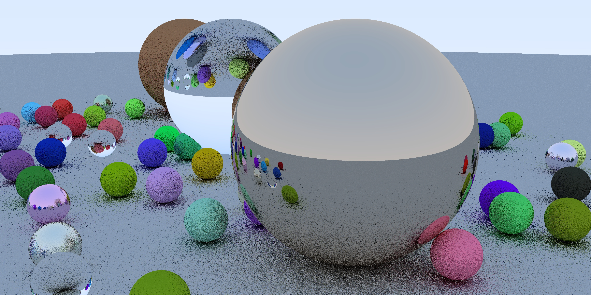

# CG-RayTracer
(Personal practising) 

implementation of “Ray Tracing in one Weekend“ by ___Peter Shirley___ 

Properties:  

- in Python3, numpy, cv2

- in infant stage, bug exists maybe
- single thread, to be improved

:white_check_mark: First Week

> :white_check_mark: Preparations, basic headers
>
> :white_check_mark: Sphere and object list
>
> :white_check_mark: Antialiasing
>
> :white_check_mark: Materials(lambertian, metal, dielectric)
>
> :white_check_mark: Reflection and refraction
>
> :white_check_mark: Camera position and blur

:white_circle: Next Week

>
>
>:white_check_mark: Moving sphere
>
>:white_check_mark: BVH speed-up
>
>:white_check_mark: Textures
>
>:white_check_mark:  Perlin noise
>
>:white_check_mark: Texture mapping
>
>:white_check_mark: Rectangles and lights
>
>:white_circle: Instances and volumes 

Snaps:

